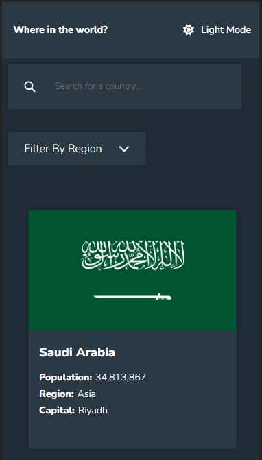
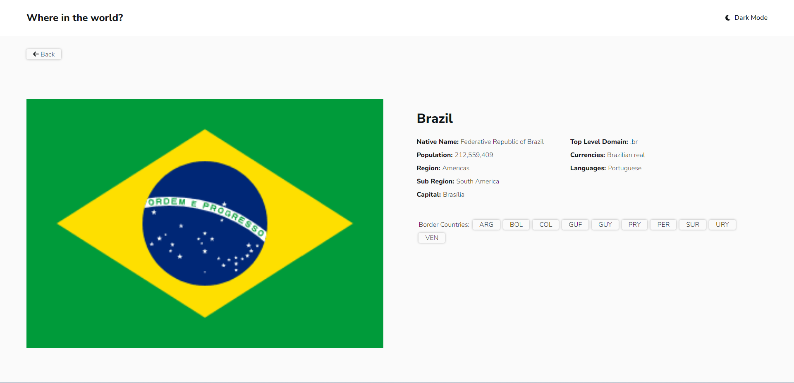

# AngularRestCountriesApi

Esse projeto foi criado para fins acadêmicos e desenvolvido com base na interface do desafio da plataforma [Frontend Mentor](https://www.frontendmentor.io).

### Funcionalidades da aplicação
  * Visualização de todos os países na home
  * Visualizar detalhes de cada país
  * Buscar países pelo nome
  * Filtrar países pelo continente a que pertencem
  * Mudar o tema da aplicação

### Para o desenvovimento da aplicação foram utilizados

  * Angular 16
  * SASS
  * RXJS
  * Font Awesome
  * Consumo de API REST

### Deploy da aplicação
O funcionamento do projeto pode ser acessado [clicando aqui](https://angular-rest-countries-api.vercel.app/)

### Imagens do projeto

## Development server

Run `ng serve` for a dev server. Navigate to `http://localhost:4200/`. The application will automatically reload if you change any of the source files.

## Code scaffolding

Run `ng generate component component-name` to generate a new component. You can also use `ng generate directive|pipe|service|class|guard|interface|enum|module`.

## Build

Run `ng build` to build the project. The build artifacts will be stored in the `dist/` directory.

## Running unit tests

Run `ng test` to execute the unit tests via [Karma](https://karma-runner.github.io).

## Running end-to-end tests

Run `ng e2e` to execute the end-to-end tests via a platform of your choice. To use this command, you need to first add a package that implements end-to-end testing capabilities.

## Further help

To get more help on the Angular CLI use `ng help` or go check out the [Angular CLI Overview and Command Reference](https://angular.io/cli) page.
